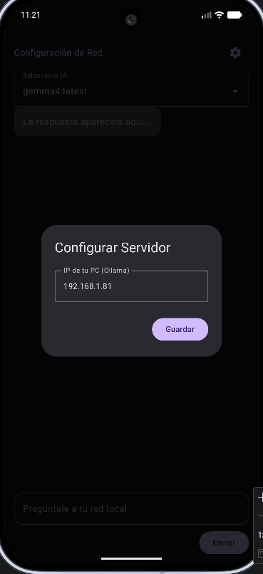
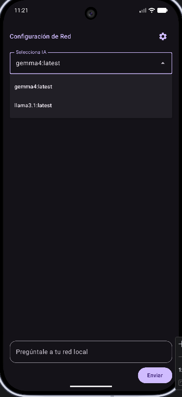
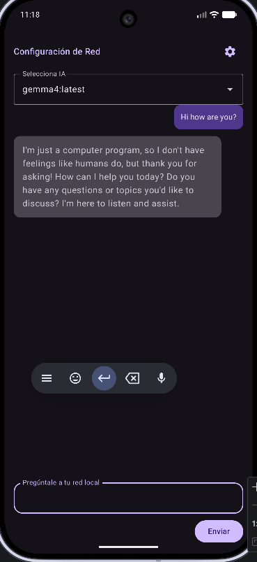

# AIlocalNetwork 📱🤖

A native Android application built with **Jetpack Compose** and **Ktor** to interact with an **Ollama** instance over a local network via HTTP.

## 🚀 Features

- **Dynamic Configuration:** Easily set your server's IP address within the app—no recompilation needed.
- **Model Discovery:** Automatically fetches and lists all LLMs installed on your Ollama server for quick switching.
- **Local Network Power:** Offload AI processing to your powerful desktop or server (GPU-accelerated) while chatting from your phone.
- **Material 3 UI:** Clean, modern interface with native dark mode support.

## 📸 Screenshots

| Connection & IP | Model Selection | Chat Interface |
| :---: | :---: | :---: |
|  |  |  |

## 🚧 Work in Progress
- [ ] Local conversation history (Persistence).
- [ ] Support for streaming responses.
- [ ] Image support for multimodal models (Ollama Vision).

## 📺 Demo & Download
- 🎥 **Watch in action:** [YouTube Shorts](https://youtube.com/shorts/7Yifv6agxg8?feature=share)
- 📦 **Download APK:** [Latest Release](https://github.com/ulisesSan/AIlocalNetowork/releases/tag/V.0.0.3)